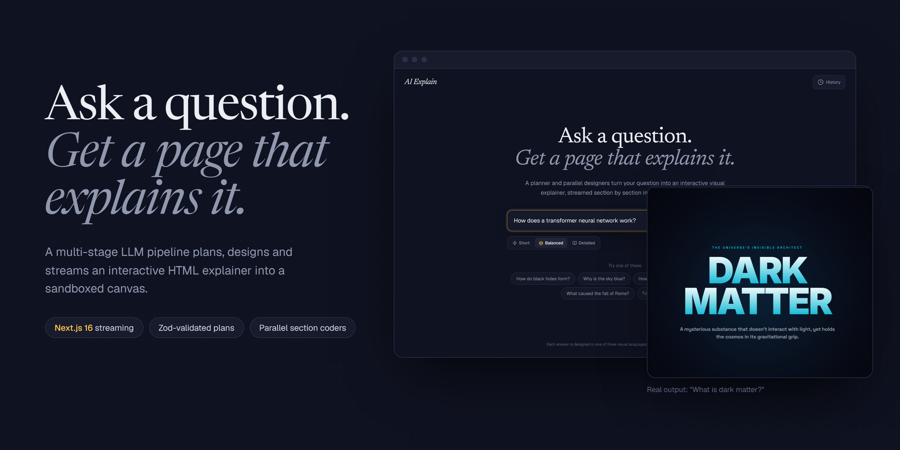
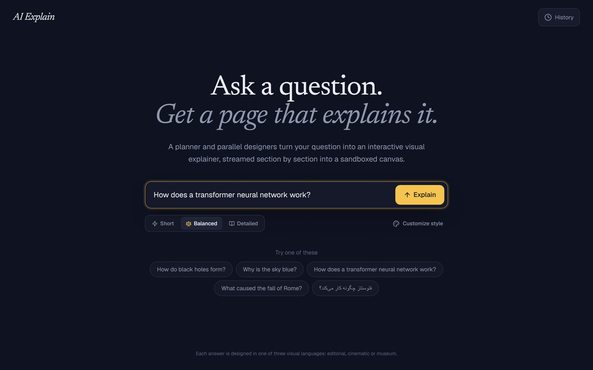
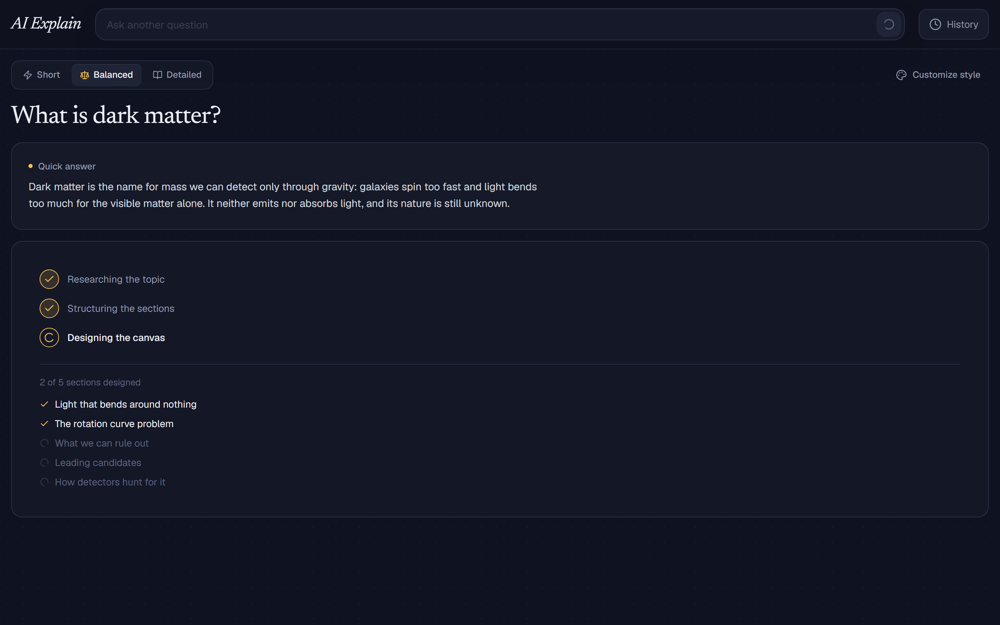
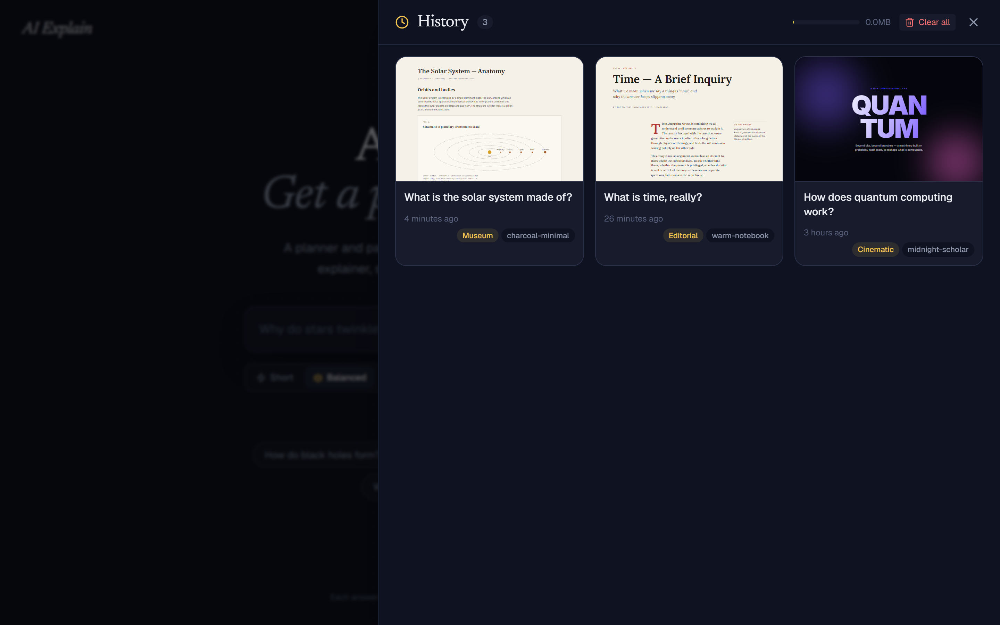
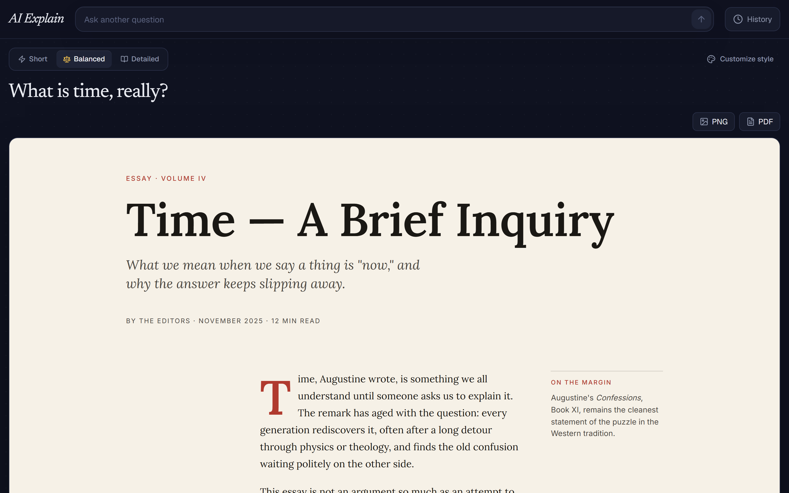
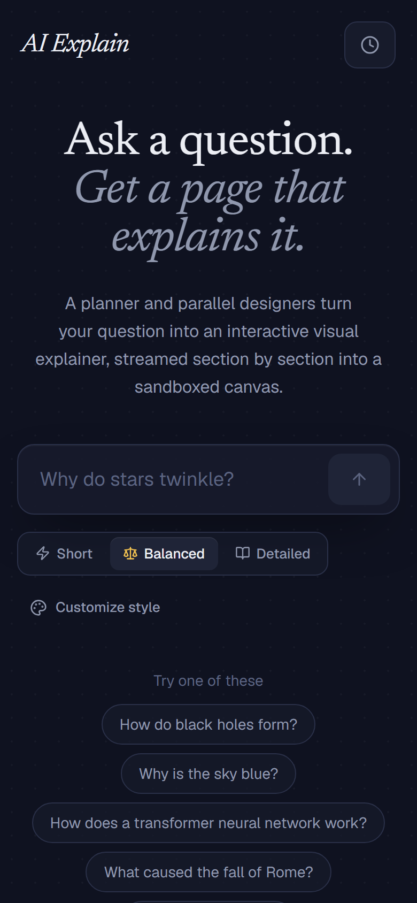
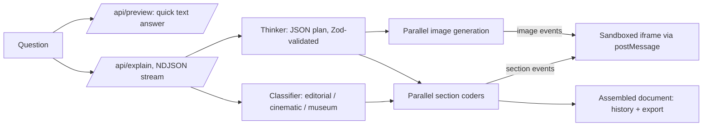

# AI Explain



**Ask any question and get an interactive HTML/CSS/SVG explainer page, planned and designed by a multi-stage LLM pipeline and streamed section by section into a sandboxed iframe.**


## Highlights

- **Planner, then parallel designers.** A classifier and a Zod-validated JSON planner run in parallel; then one coder call per section runs in parallel, with images generated alongside.
- **Streams as it designs.** An NDJSON event stream drives a live progress view and appends finished sections into the canvas in order.
- **Three design languages.** Every answer is typeset as an editorial essay, a cinematic poster or a museum plate, picked per question.
- **Safe by construction.** Generated code runs in an opaque-origin sandboxed iframe; exports are DOMPurify-sanitised.
- **Local history and export.** Finished canvases are kept in the browser with live thumbnails and can be exported to PNG or PDF.

## Screenshots

| | |
|---|---|
|  |  |
| **Landing.** Ask anything, pick a detail level, or start from an example (English or Persian). | **Generating** *(demo data)*. The planned sections tick off as the parallel coders finish. |
|  |  |
| **History** *(demo data)*. Saved canvases with live thumbnails, design language and preset. | **Canvas view** *(demo data)*. A saved canvas reopened, with PNG/PDF export. |

<p align="center"></p>

Real model output (cinematic design language, "What is dark matter?"):


The *demo data* screenshots need no API key: history is seeded with the hand-written reference canvases that ship in `src/lib/vocabularies/` (the worked examples given to the coder prompt, not model output), and the progress view is driven by synthetic stream events. Recreate them with `node scripts/capture-screenshots.mjs` against a running server (see the header of that file; needs Playwright).

## Why it's interesting

- **Multi-stage orchestration, not one prompt.** A classifier and a planner run in parallel, then one coder call per section runs in parallel, with images generated alongside.
- **Structured planning.** The planner returns a strict JSON content plan (`response_format: json_schema`) that is validated with Zod (`src/lib/plan-schema.ts`); section `imageIds` reference `images[].id` so the plan is the single source of truth.
- **Progressive rendering.** `/api/explain` emits an NDJSON event stream; sections are appended into the live canvas via `postMessage` as they finish, in order.
- **Three design languages.** The classifier routes each question to an editorial, cinematic or museum vocabulary (`src/lib/vocabularies/`), each with tokens, layout guidance and a worked example injected into the coder prompt.
- **Graceful degradation.** Monolithic coder fallback if the plan has no body sections, stub section if a section coder fails, per-stage timeouts budgeted under `maxDuration = 300`.

## Architecture



"Short" mode skips the planner and images and uses a single coder call. Generated markup uses declarative `data-ae="..."` attributes (tabs, accordions, charts, sliders, reveals...) that an injected runtime (`src/lib/ae-primitives.ts`) wires up, so the model does not hand-write interaction JS.

## Tech stack

Next.js 16 (App Router), React 19, TypeScript, Tailwind CSS 4, Zod 4, OpenRouter (Gemini models, configurable), DOMPurify + html2canvas-pro + jsPDF for export, lucide-react.

## Key techniques

- Structured output + schema validation: `src/lib/plan-schema.ts`, `generateStructured` in `src/lib/openrouter.ts`
- Prompt construction per role and vocabulary: `src/lib/prompts.ts`, `src/lib/vocabularies/`
- Parallel fan-out, streaming and fallbacks: `src/app/api/explain/route.ts`
- Image generation conditioned on the palette: `src/lib/image-gen.ts`
- In-frame interactivity runtime and host bridge: `src/lib/ae-primitives.ts`

## Getting started

```bash
npm install
cp .env.example .env.local   # set OPENROUTER_API_KEY and model names
npm run dev
```

Open http://localhost:3000. Other scripts: `npm run build`, `npm run start`, `npm run lint`.

| Variable | Description |
|----------|-------------|
| `OPENROUTER_API_KEY` | OpenRouter API key |
| `OPENROUTER_MODEL` | Section coders and monolithic fallback |
| `OPENROUTER_FAST_MODEL` | Classifier, planner, short coder, preview |
| `OPENROUTER_IMAGE_MODEL` | Image generation |

## Tests

There are no automated tests yet.

## Security notes

- **Iframe sandbox.** Generated canvases render in `<iframe srcDoc={html} sandbox="allow-scripts">` (`src/components/canvas-frame.tsx`, also the history thumbnails). Scripts run, but in an opaque origin: no access to the parent DOM, cookies or storage. `allow-same-origin` is deliberately not combined with `allow-scripts`. Parent and canvas communicate only through `postMessage`.
- **Export.** PNG/PDF export sanitizes the HTML with DOMPurify (scripts and `on*` handlers stripped) and renders it in a separate `sandbox="allow-same-origin"` iframe with no script execution.
- **No rate limit or auth on `/api/explain` (and `/api/preview`).** Inputs are Zod-validated, but anyone who can reach the server can trigger paid OpenRouter calls. Put it behind auth or a rate limiter before exposing it publicly, and set a spend cap on the API key.

## License

MIT

---

<sub>Built by <a href="https://sepehrradmard.ir">Sepehr Radmard</a> · <a href="https://www.linkedin.com/in/sepehr-radmard/">LinkedIn</a> · <a href="https://github.com/sepehr071">GitHub</a> · more projects on my <a href="https://github.com/sepehr071">profile</a></sub>
